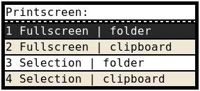

# rofigen - Generates rofi application

## Getting Started

To run `rofigen` you must pass a script, like `./rofigen ~/kawaiifaces`.

You can bindsym your i3, e. g., `bindsym $mod+Ctrl+l exec ~/Documents/rofigen/rofigen ~/kawaiifaces`.

### Example #1 - Kawaii Faces

```bash
#!/bin/bash

title="Kawaii faces:"
widthpercent=10

typeset -A menu
menu=(
    [¯\_(ツ)_/¯]="~/sh_kawaiifaces 1"
    [( ͡° ͜ʖ ͡°)]="~/sh_kawaiifaces 2"
    [ಠ_ಠ]="~/sh_kawaiifaces 3"
    [◕‿◕]="~/sh_kawaiifaces 4"
    [(╯°□°）╯︵ ┻━┻]="~/sh_kawaiifaces 5"
    [Cancel]=""
)
menu_nrows=${#menu[@]}
```

#### Output


### Example #2 - Printscreen

```bash
#!/bin/bash

title="Printscreen:"
widthpercent=15

typeset -A menu
menu=(
  [Selection | clipboard]="~/sh_printscreen 4"
  [Selection | folder]="~/sh_printscreen 3"
  [Fullscreen | clipboard]="~/sh_printscreen 2"
  [Fullscreen | folder]="~/sh_printscreen 1"
  [Cancel]=""
)
menu_nrows=${#menu[@]}
```

#### Output



## Configuring

To create a new menu, your script must contain these:

- `title` title displayed
- `widthpercent` set width of menu, is specified in percentage
- `menu` menu items: [text]="command_to_execute"
